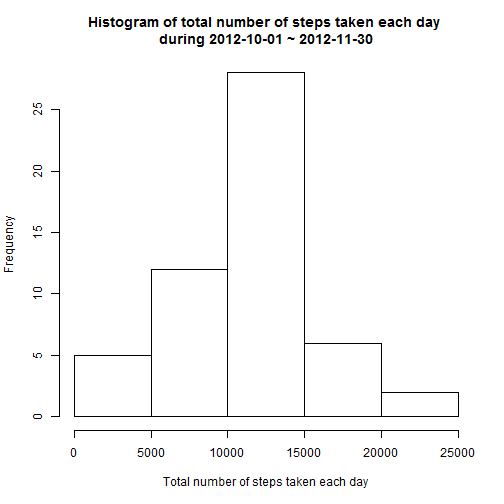
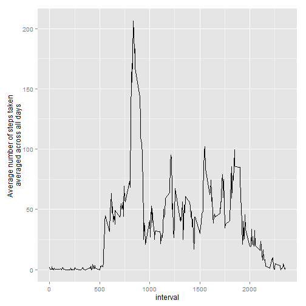
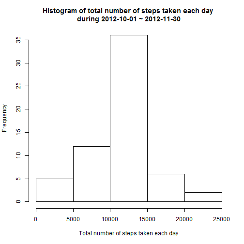
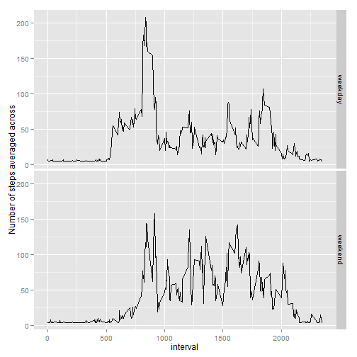

##0. Loading packages and set working directory

```r
require(dplyr)
require(plyr)
require(ggplot2)

setwd("C:\\Users\\YUCHOUCHEN\\Documents\\R programming\\RepData_PeerAssessment1")
```

##1. Loading and preprocessing the data

```r
# 1.1 Load the data
inFile <- "./activity.csv"
data <- read.csv(inFile, sep = ",", header = TRUE, stringsAsFactors = FALSE)
```


```r
# 1.2 Process/transform the data (if necessary) into a format suitable for your 
# analysis
data$date <- as.POSIXct(data$date)
```

##2. What is mean total number of steps taken per day?

```r
# 2.2 Calculate and report the mean and median total number of steps taken per 
# day

# Calculate the mean and median total number of steps taken per day
sum <- ddply(data, .(date), summarize, total = sum(steps), 
           meanDaily = mean(steps, na.rm = TRUE), 
           medianDaily = median(steps, na.rm = TRUE))
# Report the mean and median total number of steps taken per day
options(digits = 1) # set the number of digits to print = 1
select(sum, date, meanDaily, medianDaily)
```

```
##          date meanDaily medianDaily
## 1  2012-10-01       NaN          NA
## 2  2012-10-02       0.4           0
## 3  2012-10-03      39.4           0
## 4  2012-10-04      42.1           0
## 5  2012-10-05      46.2           0
## 6  2012-10-06      53.5           0
## 7  2012-10-07      38.2           0
## 8  2012-10-08       NaN          NA
## 9  2012-10-09      44.5           0
## 10 2012-10-10      34.4           0
## 11 2012-10-11      35.8           0
## 12 2012-10-12      60.4           0
## 13 2012-10-13      43.1           0
## 14 2012-10-14      52.4           0
## 15 2012-10-15      35.2           0
## 16 2012-10-16      52.4           0
## 17 2012-10-17      46.7           0
## 18 2012-10-18      34.9           0
## 19 2012-10-19      41.1           0
## 20 2012-10-20      36.1           0
## 21 2012-10-21      30.6           0
## 22 2012-10-22      46.7           0
## 23 2012-10-23      31.0           0
## 24 2012-10-24      29.0           0
## 25 2012-10-25       8.7           0
## 26 2012-10-26      23.5           0
## 27 2012-10-27      35.1           0
## 28 2012-10-28      39.8           0
## 29 2012-10-29      17.4           0
## 30 2012-10-30      34.1           0
## 31 2012-10-31      53.5           0
## 32 2012-11-01       NaN          NA
## 33 2012-11-02      36.8           0
## 34 2012-11-03      36.7           0
## 35 2012-11-04       NaN          NA
## 36 2012-11-05      36.2           0
## 37 2012-11-06      28.9           0
## 38 2012-11-07      44.7           0
## 39 2012-11-08      11.2           0
## 40 2012-11-09       NaN          NA
## 41 2012-11-10       NaN          NA
## 42 2012-11-11      43.8           0
## 43 2012-11-12      37.4           0
## 44 2012-11-13      25.5           0
## 45 2012-11-14       NaN          NA
## 46 2012-11-15       0.1           0
## 47 2012-11-16      18.9           0
## 48 2012-11-17      49.8           0
## 49 2012-11-18      52.5           0
## 50 2012-11-19      30.7           0
## 51 2012-11-20      15.5           0
## 52 2012-11-21      44.4           0
## 53 2012-11-22      70.9           0
## 54 2012-11-23      73.6           0
## 55 2012-11-24      50.3           0
## 56 2012-11-25      41.1           0
## 57 2012-11-26      38.8           0
## 58 2012-11-27      47.4           0
## 59 2012-11-28      35.4           0
## 60 2012-11-29      24.5           0
## 61 2012-11-30       NaN          NA
```


```r
# 2.1 Make a histogram of the total number of steps taken each day
hist(sum$total,
     main = "Histogram of total number of steps taken each day \nduring 2012-10-01 ~ 2012-11-30", 
     xlab = "Total number of steps taken each day")
```

 

##3. What is the average daily activity pattern?

```r
# 3.1 Make a time series plot (i.e. type = "l") of the 5-minute interval (x-axis) 
# and the average number of steps taken, averaged across all days (y-axis)
newIData<-ddply(data, .(interval), summarize, aver = mean(steps, na.rm = TRUE))
ggplot(newIData, aes(interval, aver)) + geom_line() +
      ylab("Average number of steps taken \naveraged across all days")
```

 


```r
# 3.2 Which 5-minute interval, on average across all the days in the dataset, 
# contains the maximum number of steps?
newIData$interval[newIData$aver == max(newIData$aver)]
```

```
## [1] 835
```
The total number of missing values in the dataset is 835.

##4. Imputing missing values

```r
# 4.1 Calculate and report the total number of missing values in the dataset
# (i.e. the total number of rows with NAs)
sum(is.na(data$steps))
```

```
## [1] 2304
```
The total number of missing values in the dataset is 2304.


```r
# 4.2 Devise a strategy for filling in all of the missing values in the dataset.
# Calculate the mean of all steps data. Will assign allMean to the missing data.
allMean <- mean(data$steps, na.rm = TRUE)
```


```r
# 4.3 Create a new dataset that is equal to the original dataset but with the 
# missing data filled in.

# Declare a new dataset: newData
newData <- data
# Assign the mean of all steps data to the missing data
newData$steps[is.na(data$steps)] <- allMean
```


```r
# 4.4 Make a histogram of the total number of steps taken each day and Calculate 
# and report the mean and median total number of steps taken per day. Do these 
# values differ from the estimates from the first part of the assignment? What 
# is the impact of imputing missing data on the estimates of the total daily 
# number of steps?

# Calculate the mean and median total number of steps taken per day
newSum<-ddply(newData, .(date), summarize, total = sum(steps), 
           meanDaily = mean(steps, na.rm = TRUE), 
           medianDaily = median(steps, na.rm = TRUE))
# Report the mean and median total number of steps taken per day
options(digits = 1) # set the number of digits to print = 1
select(newSum, date, meanDaily, medianDaily)
```

```
##          date meanDaily medianDaily
## 1  2012-10-01      37.4          37
## 2  2012-10-02       0.4           0
## 3  2012-10-03      39.4           0
## 4  2012-10-04      42.1           0
## 5  2012-10-05      46.2           0
## 6  2012-10-06      53.5           0
## 7  2012-10-07      38.2           0
## 8  2012-10-08      37.4          37
## 9  2012-10-09      44.5           0
## 10 2012-10-10      34.4           0
## 11 2012-10-11      35.8           0
## 12 2012-10-12      60.4           0
## 13 2012-10-13      43.1           0
## 14 2012-10-14      52.4           0
## 15 2012-10-15      35.2           0
## 16 2012-10-16      52.4           0
## 17 2012-10-17      46.7           0
## 18 2012-10-18      34.9           0
## 19 2012-10-19      41.1           0
## 20 2012-10-20      36.1           0
## 21 2012-10-21      30.6           0
## 22 2012-10-22      46.7           0
## 23 2012-10-23      31.0           0
## 24 2012-10-24      29.0           0
## 25 2012-10-25       8.7           0
## 26 2012-10-26      23.5           0
## 27 2012-10-27      35.1           0
## 28 2012-10-28      39.8           0
## 29 2012-10-29      17.4           0
## 30 2012-10-30      34.1           0
## 31 2012-10-31      53.5           0
## 32 2012-11-01      37.4          37
## 33 2012-11-02      36.8           0
## 34 2012-11-03      36.7           0
## 35 2012-11-04      37.4          37
## 36 2012-11-05      36.2           0
## 37 2012-11-06      28.9           0
## 38 2012-11-07      44.7           0
## 39 2012-11-08      11.2           0
## 40 2012-11-09      37.4          37
## 41 2012-11-10      37.4          37
## 42 2012-11-11      43.8           0
## 43 2012-11-12      37.4           0
## 44 2012-11-13      25.5           0
## 45 2012-11-14      37.4          37
## 46 2012-11-15       0.1           0
## 47 2012-11-16      18.9           0
## 48 2012-11-17      49.8           0
## 49 2012-11-18      52.5           0
## 50 2012-11-19      30.7           0
## 51 2012-11-20      15.5           0
## 52 2012-11-21      44.4           0
## 53 2012-11-22      70.9           0
## 54 2012-11-23      73.6           0
## 55 2012-11-24      50.3           0
## 56 2012-11-25      41.1           0
## 57 2012-11-26      38.8           0
## 58 2012-11-27      47.4           0
## 59 2012-11-28      35.4           0
## 60 2012-11-29      24.5           0
## 61 2012-11-30      37.4          37
```


```r
hist(newSum$total,
     main = "Histogram of total number of steps taken each day \nduring 2012-10-01 ~ 2012-11-30", 
     xlab = "Total number of steps taken each day")
```

 

##5. Are there differences in activity patterns between weekdays and weekends?

```r
# 5.1 Create a new factor variable in the dataset with two levels - "weekday" 
# and "weekend" indicating whether a given date is a weekday or weekend day.

# Create a new column WD for marking "weekday" or "weekend"
newData <- mutate(newData, WD = " ")

# Assign "weekday" or "weekend" to WD column based on date column
newData$WD[weekdays(newData$date) == "Saturday" | 
                 weekdays(newData$date) == "Sunday"] <- "weekend"
newData$WD[newData$WD != "weekend"] <- "weekday"

# Transform class of WD from character to factor
newData$WD <- factor(newData$WD, levels=c("weekday", "weekend"))
```


```r
# 5.2 Make a panel plot containing a time series plot (i.e. type = "l") of the 
# 5-minute interval (x-axis) and the average number of steps taken, averaged 
# across all weekday days or weekend days (y-axis). 
newTData<-ddply(newData, .(interval, WD), summarize, 
                meanWgroup = mean(steps, na.rm = TRUE))

ggplot(newTData, aes(interval, meanWgroup)) + geom_line() + facet_grid(WD ~ .) +
      ylab("Number of steps averaged across")
```

 
